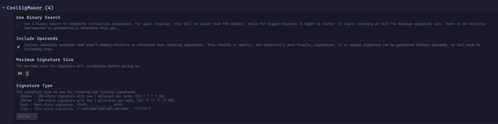
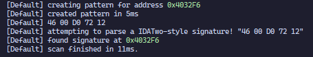

# binja_coolsigmaker (dev channel)

(**The dev branch now contains the version of the plugin for the binja development update channel.**)

(**master/main will target stable.**)

We all know signature scanning can be extremely useful. Sadly, the two public offerings for Binja are either very slow, or crash extremely often.

This is why I wrote this plugin. It's a signature scanning and creating plugin for x86 (more archs are planned!), written in Rust. It's extremely fast, supports multiple signature styles, and works like a charm.

[Blog Post](https://binary.ninja/2024/10/01/plugin-spotlight-coolsigmaker.html)

It supports 3 styles of signatures. Or 4, if you want to be specific.

To create a signature, select the instruction you want the signature to point to, then go to `Plugins->CSM - Create Signature`.

The signature is checked for uniqueness within all executable segments of the binary. `.data` is not considered, so make sure your signature scanning implementation also ignores non-code sections.

To find a signature, copy the signature to your clipboard in the format you selected in the configuration, and go to `Plugins->CSM - Find Signature`. All occurrences will be in your log.

These are the settings:

This is how it looks to create a signature, then scan for it:

## How to install

1. Download the platform-appropriate binary from release section
2. Place the binary in your Binary Ninja installation's plugin folder

Once GitHub Actions are set up and a loader plugin has been written, you will be able to install the plugin via the official plugin manager.

## Compiling yourself

This project requires the nightly channel of Rust.

Check the blog post above for a step-by-step.

Checkout the branch of the repository matching the channel of binja you are building for.

You are now one `cargo b` away from greatness.
